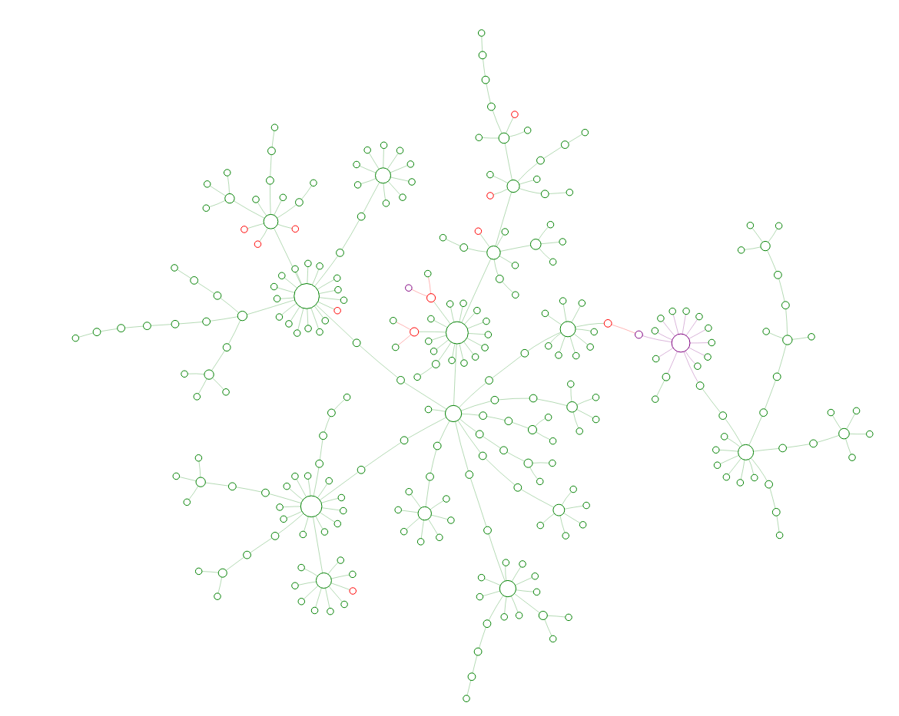

Visgence Inc. 2017
# Icinga 2 Dependency Module
## A tool for mapping network topography and displaying realtime status of Icinga 2 Networks based on dependency data



## Format of Hosts
### Custom Variable "Parents"
### Migration From Icinga 1/ Nagios

## Icinga 2 Dependency Apply Rule

## Create Database And Users
### Install and start postgres
1.  Install postgresql `yum install -y postgresql-server postgresql`
2.  Initialize db `postgresql-setup initdb`
3.  Enable and start service 
```
systemctl enable postgresql
systemctl start postgresql
```
### Setup db and User
```
sudo -u postgres psql -c "CREATE ROLE dependencies WITH LOGIN PASSWORD 'dependencies'"
sudo -u postgres createdb -O dependencies -E UTF8 dependencies
```

Add the following to /var/lib/pgsql/data/pg_hba.conf - *above* other ident commands

```
# icinga
local   dependencies      dependencies                            md5
host    dependencies      dependencies      127.0.0.1/32          md5
host    dependencies      dependencies      ::1/128               md5
```

Next restart postgres `service postgresql restart`

### Create Schema
`export PGPASSWORD=dependencies`
`psql -U icinga -d icinga < /usr/share/icingaweb2/modules/dependency_plugin/application/schema`


